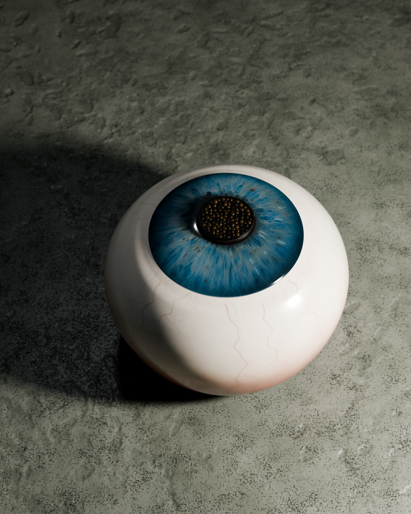
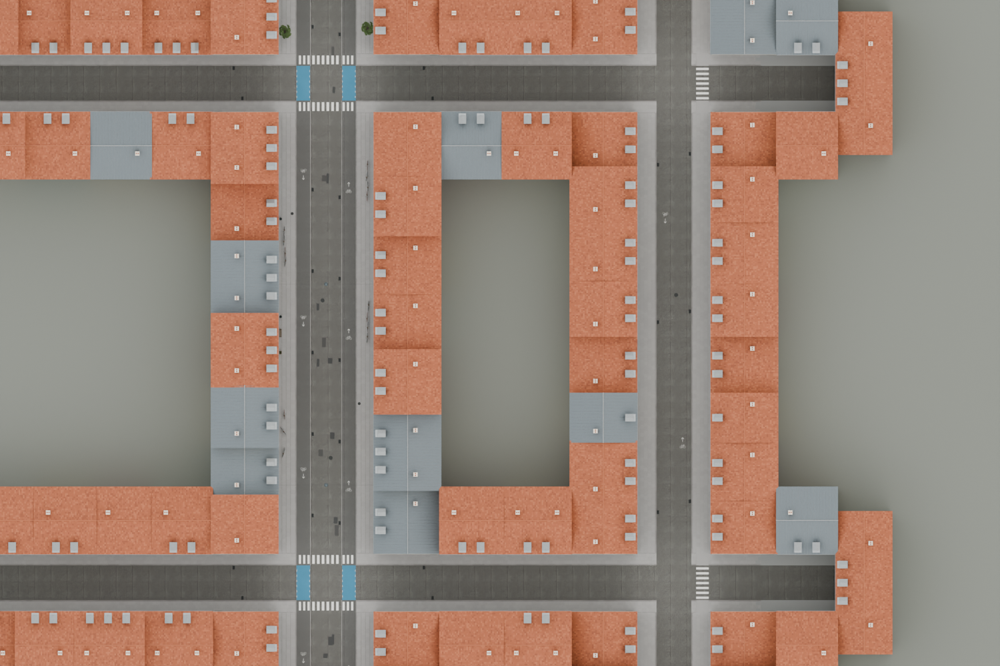
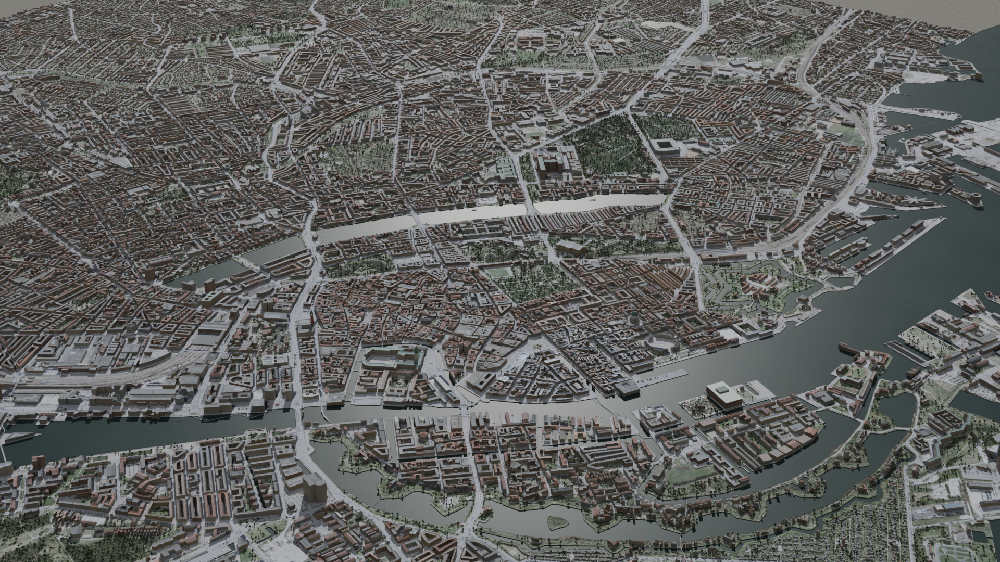
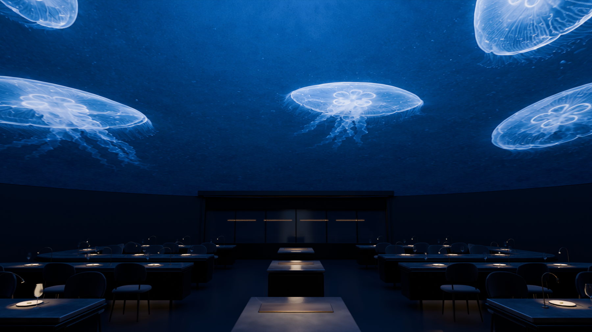
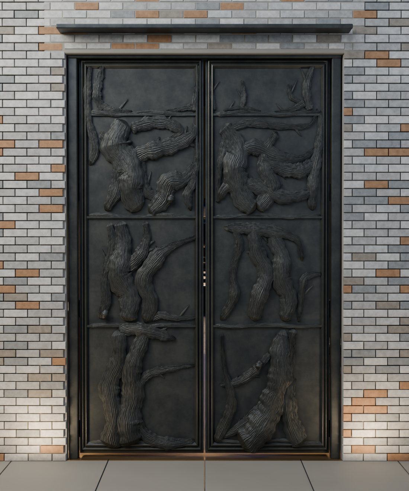
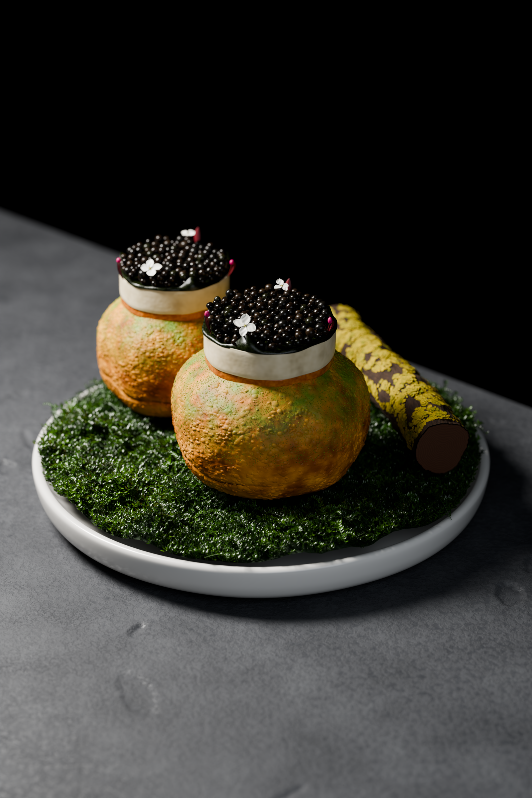

# Holly — Blender Rendering

A collection of Blender projects, organized by the work: an eye dish, Copenhagen street and aerial scenes, the Alchemist restaurant, a plated dish with a web viewer, an Antini cocktail study, and the original dome study.

**[Latest asset updates](https://github.com/tangxiya-star/holly-blender-rendering/releases/tag/v2026.09.08-workspace-snapshot)** · **[Browse the asset manifest](docs/assets-manifest.json)**

This repository is public. Code, project guides, reports, and selected previews are in Git. Full Blender scenes, renders, textures, model exports, and large geographic datasets are in the release. **Cloning or downloading the repository alone does not include these large assets.**

## Projects

| Folder | Project | Latest scene or entry point |
| --- | --- | --- |
| [eyeball/](eyeball/README.md) | Editable eye dish and seven material/geometry iterations | `eyeball/eye_07.blend` |
| [city-scene/street/](city-scene/street/README.md) | Copenhagen street and expanded neighborhood | `city-scene/street/copenhagen_neighborhood.blend` |
| [city-scene/aerial/](city-scene/aerial/README.md) | Geographic Copenhagen city aerial and cinematic descent | `city-scene/aerial/copenhagen_aerial_final.blend` |
| [restaurant/](restaurant/README.md) | Alchemist-inspired restaurant, walkthrough, and web model | `restaurant/alchemist_06c_refine.blend` |
| [food/](food/README.md) | Plated dish study and interactive web preview | `food/food_final.blend`; `food/web-preview/` |
| [cocktail/](cocktail/README.md) | Antini cocktail and numbered render studies | `cocktail/cocktail_08.blend` |
| [dome/](dome/README.md) | Original dome study | `dome/alchemist_dome.blend` |

Each project keeps its own scripts, reports, references, and asset paths. Earlier scene and render iterations are preserved in its asset package. Historical source snapshots and validation reports remain records of their original builds; their old local paths and hashes are not rewritten to imply a new validation run.

## Previews

### Eye dish — iteration 07



### Copenhagen neighborhood



### Copenhagen city aerial



### Alchemist restaurant



### Restaurant entry — refinement 06c



### Antini cocktail — iteration 08


### Plated dish



The [dome project](dome/README.md) has its own preview. These are the existing renders, not new renders produced during this archive update.

## Download by project

The six original project packages below remain available on `v2026.09.08-projects`. Additions and changed assets are published separately on `v2026.09.08-local-sync`, so unchanged multi-gigabyte assets do not need to be uploaded again. The restore tool combines the exact versions listed in the manifest. Every archive preserves paths relative to the repository root.

| Release asset | Size | Contents |
| --- | ---: | --- |
| [eyeball-assets.zip](https://github.com/tangxiya-star/holly-blender-rendering/releases/download/v2026.09.08-projects/eyeball-assets.zip) | 594.94 MiB | Seven eye scenes, main and orbit renders, linear EXRs, iris texture, and reference images |
| [city-street-assets.zip](https://github.com/tangxiya-star/holly-blender-rendering/releases/download/v2026.09.08-projects/city-street-assets.zip) | 154.99 MiB | Five street/neighborhood scenes, renders, CC0 road textures and HDR, reference images |
| [city-aerial-assets.zip](https://github.com/tangxiya-star/holly-blender-rendering/releases/download/v2026.09.08-projects/city-aerial-assets.zip) | 292.46 MiB | Two aerial scenes, renders, raw and derived OSM data, imagery atlases, diagnostic images, and its own HDR |
| [restaurant-assets.zip](https://github.com/tangxiya-star/holly-blender-rendering/releases/download/v2026.09.08-projects/restaurant-assets.zip) | 108.04 MiB | Restaurant checkpoints, separately recovered restaurant edits, all restaurant renders, textures, references, and web Blender/GLB |
| [food-assets.zip](https://github.com/tangxiya-star/holly-blender-rendering/releases/download/v2026.09.08-projects/food-assets.zip) | 471.34 MiB | Five dish scenes, renders, reference, web Blender/GLB, and split glTF/BIN for the viewer |
| [dome-assets.zip](https://github.com/tangxiya-star/holly-blender-rendering/releases/download/v2026.09.08-projects/dome-assets.zip) | 1.73 MiB | Original dome Blender scene and render |

### Incremental additions

| Update archive | Size | Contents |
| --- | ---: | --- |
| [cocktail-assets.zip](https://github.com/tangxiya-star/holly-blender-rendering/releases/download/v2026.09.08-local-sync/cocktail-assets.zip) | 45.60 MiB | Seven cocktail scenes and seven PNG renders |
| [restaurant-refinements.zip](https://github.com/tangxiya-star/holly-blender-rendering/releases/download/v2026.09.08-local-sync/restaurant-refinements.zip) | 267.61 MiB | Restaurant 06a/06b/06c scenes, review images, door references, and the microheight texture integrated in 06c |
| [eyeball-updates.zip](https://github.com/tangxiya-star/holly-blender-rendering/releases/download/v2026.09.08-local-sync/eyeball-updates.zip) | 193.43 MiB | Updated `eye_07.blend` and the pre-cocktail eye-session checkpoint |

The final workspace snapshot adds these files on `v2026.09.08-workspace-snapshot`:

| Final update archive | Size | Contents |
| --- | ---: | --- |
| [cocktail-finalization.zip](https://github.com/tangxiya-star/holly-blender-rendering/releases/download/v2026.09.08-workspace-snapshot/cocktail-finalization.zip) | 21.33 MiB | Round 08 scene, PNG and EXR, its environment preview, and a separate round 07 review file |
| [restaurant-reference-updates.zip](https://github.com/tangxiya-star/holly-blender-rendering/releases/download/v2026.09.08-workspace-snapshot/restaurant-reference-updates.zip) | 3.31 MiB | Entrance reference and a generated height guide for the unfinished round 07 relief work |

Round 08 completed in a separate native Blender process during synchronization. The latest saved restaurant scene remains 06c; the newer relief script and height guide do not constitute a completed round 07 scene.

Selecting `restaurant-assets.zip`, `eyeball-assets.zip`, or `cocktail-assets.zip` automatically includes all corresponding update archives. Unchanged files still come from the original project release. The archive manifest records the old eye-file hash explicitly; only that known previous version may be upgraded in place.

The release includes `assets-manifest.json` with every asset path, size, and SHA-256, and `SHA256SUMS.txt` with archive checksums. The food viewer's identical model copies are uploaded once and recreated by the restore script. The aerial package includes its own HDR so it can be restored independently of the street package.

Automatic `.blend1` backups, dependency folders, build caches, and local runtime/debug logs are omitted. The separately recovered restaurant scene is retained under `restaurant/backups/`. The local Chinese-named eye shortcut points to `eye_07.blend` and is not duplicated.

## Restore everything

Install Python 3.8 or later and GitHub CLI, then run:

```sh
gh auth login
gh repo clone tangxiya-star/holly-blender-rendering
cd holly-blender-rendering
python3 tools/restore_assets.py
```

This downloads the pinned base and update releases specified by `docs/assets-manifest.json`, verifies every archive and file, and installs the latest version of each path. Identical files are skipped. A known superseded release file can be upgraded; unrecognized local edits cause an error and are preserved. Use `--destination /path/to/empty-folder` to restore into a fresh location.

For just the eye dish or the city scenes:

```sh
python3 tools/restore_assets.py --archives eyeball-assets.zip
python3 tools/restore_assets.py --archives city-street-assets.zip city-aerial-assets.zip
```

You can also download ZIPs directly from the public release page without signing in. Extract them at the repository root, or verify and restore downloaded ZIPs offline:

```sh
python3 tools/restore_assets.py --from-dir /path/to/downloads
```

For offline restoration, place the required base and update ZIPs together in the download directory. For a subset, add `--archives`; choosing an eye, restaurant, or cocktail base archive also requires its update ZIPs. With a manual food restore, also copy `food/web_exports/food_web.gltf` and `food_web_*.bin` into `food/web-preview/public/model/`; the script does this automatically.

## Run the food viewer

After restoring `food-assets.zip`, use Node.js 22.13.0 or later:

```sh
cd food/web-preview
npm ci
npm run dev
```

The existing Sites configuration is preserved. This update archives the latest local code and saved assets and fixes paths affected by the folder move; it does not redeploy the viewer, regenerate web exports, or rerender scenes. Follow each project's README for Blender build steps and platform requirements. Rebuild in a separate working copy if you want to retain the delivered files.

## Scope and sources

The eye and plated-dish studies retain their original realism assessments: visible CG cues remain, and they are not claimed to pass the strict photographic realism test. The street layout is representative and fictional; the aerial scene uses geographic footprints with approximate heights and roof forms. The aerial World Labs handoff is a camera anchor and animation, with no external World Labs scene included.

Reference photographs are modeling guides, not scene textures. Preserve the source credits in each project's references and reports. City geographic data is © OpenStreetMap contributors under ODbL; the orthophoto atlas is © GeoDanmark / Klimadatastyrelsen under CC BY 4.0. See the [city overview](city-scene/README.md) and [imagery provenance](city-scene/aerial/reports/imagery_sources.md) for source and delivery-service details.

## Previous layout

The original [v2026.09.08 release](https://github.com/tangxiya-star/holly-blender-rendering/releases/tag/v2026.09.08) remains unchanged and uses the old `alchemist/` layout. Its [manifest](docs/releases/v2026.09.08/assets-manifest.json) is retained for reference. Use that tag's code to restore that version; the current restore script uses the new project folders.

| Previous workspace path | Current repository folder |
| --- | --- |
| `alchemist/cocktail_test/` | `cocktail/` |
| `alchemist/eye_food_stress_test/` | `eyeball/` |
| `copenhagen/` | `city-scene/street/` |
| `copenhagen_aerial/` | `city-scene/aerial/` |
| `alchemist/` restaurant files | `restaurant/` |
| `alchemist/food_stress_test/` | `food/` |
| `alchemist/food_web_preview/` | `food/web-preview/` |
| Root dome files | `dome/` |

For future updates, keep code and small previews in Git and publish full assets in a new release per milestone. Preserve existing release assets and checksums so teammates can recover an exact version.
