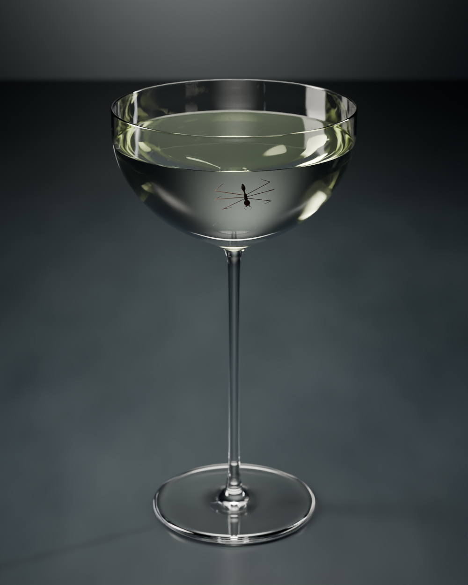

# Antini cocktail — Blender study

Open **`cocktail_07.blend`** for the latest saved iteration. This is an editable study of a glass coupe, pale straw-green liquid, an ant garnish, and a dark stone-table lighting setup. **Seven Blender scenes and seven completed 1000 × 1250 Cycles PNGs** are preserved, including the round 07 scene and render. Their presence records a saved result; it does not establish photographic realism.



## Download

From the repository root, run:

```sh
python3 tools/restore_assets.py --archives cocktail-assets.zip
```

The complete scenes and renders are in `cocktail-assets.zip` on [Release v2026.09.08-local-sync](https://github.com/tangxiya-star/holly-blender-rendering/releases/tag/v2026.09.08-local-sync). Source modules, reference notes, and reports are tracked in Git. See the [root README](../README.md) for setup and verification instructions.

## Files and recorded setup

- `cocktail_01.blend` through `cocktail_07.blend`: seven separate scene iterations.
- `renders/cocktail_01.png` through `renders/cocktail_07.png`: seven completed Cycles results.
- `reports/round_01.json` through `reports/round_07.json`: saved scene, camera, render settings, and geometry records. These records are written when each scene is saved, before its render starts.
- [reports/critique.md](reports/critique.md): recorded visual critiques through round 06 and the resulting corrections planned for round 07.
- `reports/round_01_sources/`: the original source snapshot, preserved as historical evidence.
- `scripts/`: geometry, optics, staging, ant garnish, numbered refinements, and render-control modules.

The scene is named `Cocktail | Alchemist photographic test`. [Round 07's report](reports/round_07.json) records Blender 5.2.1 LTS, 60 objects, Cycles GPU rendering configured for 512 samples, a 95 mm lens at f/20, and 20 transmission bounces. Round 06 uses f/18 at the same recorded resolution and sample setting.

Round 07 repositions the existing luminous backdrop to match the bowl's transmitted view, reduces the right-hand source, lowers modeled liquid scattering and absorption, and smooths the existing ant body contours. It modifies the existing scene objects. The retained critique has no completed round 07 visual assessment, so the latest render is not presented as a photorealism pass. No EXR, web export, or texture bake is included.

## Working with the source

These are Blender GUI/MCP modules rather than standalone command-line build scripts. Running `blender --background --python scripts/build_cocktail.py` only defines functions; it does not build the delivered scene. Open an existing scene to inspect or continue the study.

Construction uses `photo_stage`, `build_cocktail`, and `ant_garnish`. The numbered `refine_02.apply(scene)` through `refine_07.apply(scene)` functions apply subsequent changes to the appropriate preceding scene. They are incremental edits, not independent scene constructors.

`render_control.start(scene, "07", samples=512)` configures rendering, saves the selected scene and its settings report, then invokes a GUI render. It depends on an interactive Blender context and the configured GPU backend. A saved `.blend` or round report alone does not prove that the associated render finished. Reusing a round identifier can replace its saved scene and image, so use a separate working copy when continuing the study.

The pre-cocktail session checkpoint is archived separately under `eyeball/backups/pre_cocktail_session_20260908_140658.blend`. Embedded scene labels identify eye-study scenes; its full session contents have not been reopened and validated for this publication. It is not an eighth cocktail iteration or a required build input.

## Reference and limits

The reference photograph is credited to Alchemist and documented in [reference_notes.md](references/reference_notes.md), with links to InsideHook. The inferred 91 mm bowl diameter, 166 mm vessel height, and 0.85 mm rim thickness are visual reconstruction assumptions rather than manufacturer measurements. The reference photograph itself is not included in this project.

The geometry audit records closed glass and liquid meshes for the checked objects. It does not establish photographic realism or recipe accuracy. The source and rendered iterations remain available for further review.
