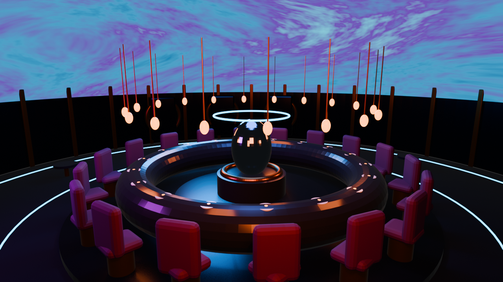

# Original dome study

The original Alchemist dome workspace, preserved separately from the full restaurant.



From the repository root, restore the editable scene and original render:

```sh
python3 tools/restore_assets.py --archives dome-assets.zip
```

Open `dome/alchemist_dome.blend` in Blender. The build script is `dome/build_alchemist_dome.py`. To rebuild the study, run the following command from the repository root; it replaces the dome scene and preview in this folder:

```sh
blender --background --factory-startup --python dome/build_alchemist_dome.py
```

See [restaurant/](../restaurant/README.md) for the full restaurant scene and [the root README](../README.md) for downloads.
